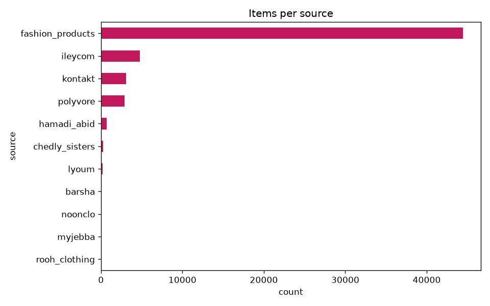
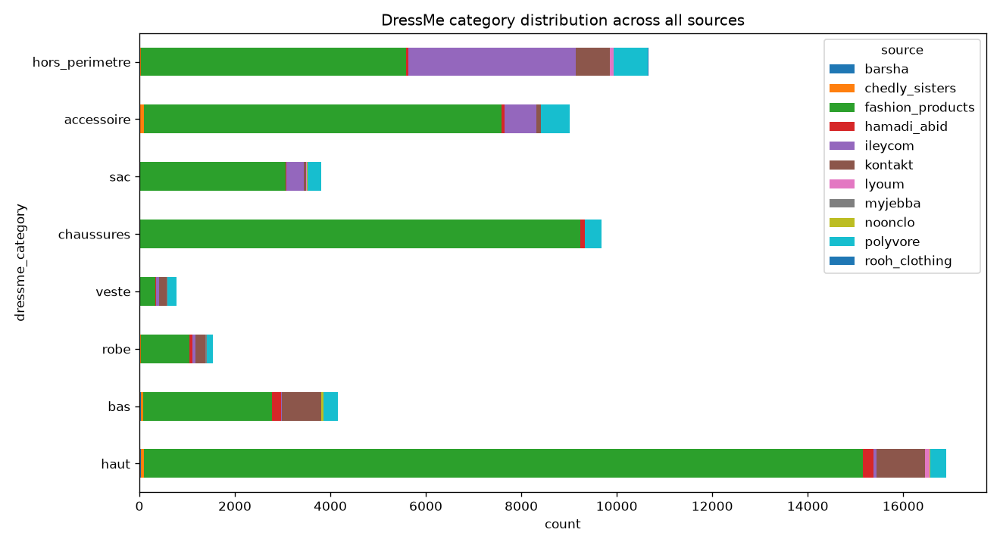
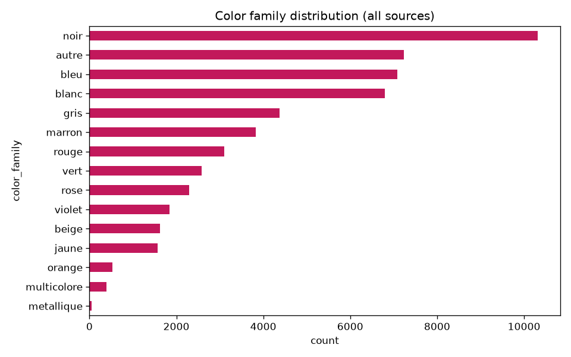
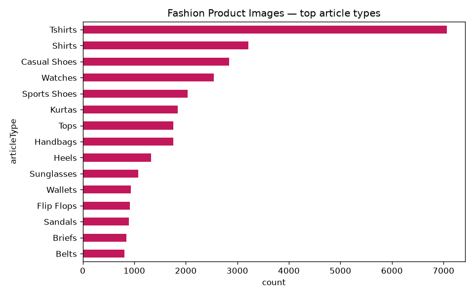
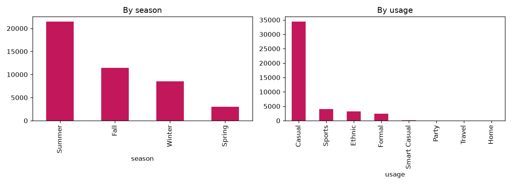
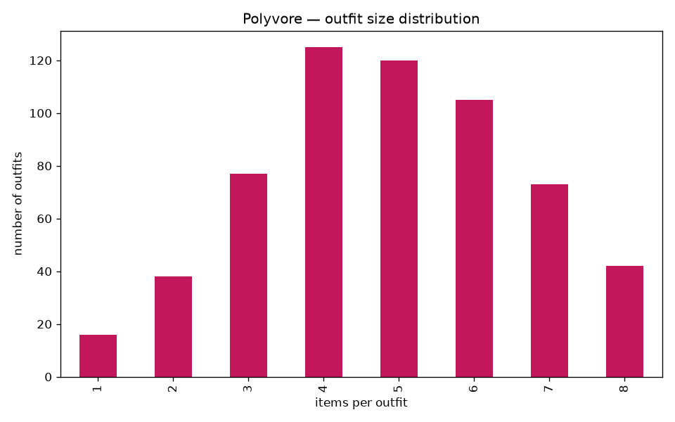

# Data Understanding — Results

## Unified catalog — all sources

- **56532 items** across **11 sources**

- Per source: fashion_products (44424), ileycom (4744), kontakt (3063), polyvore (2900), hamadi_abid (715), chedly_sisters (269), lyoum (186), barsha (98), noonclo (90), myjebba (34), rooh_clothing (9)

- In-scope rate (maps to a real DressMe category, not `hors_perimetre`): myjebba 100.0%, noonclo 98.9%, barsha 95.9%, hamadi_abid 93.3%, chedly_sisters 89.6%, fashion_products 87.5%, kontakt 76.6%, polyvore 75.0%, lyoum 60.8%, ileycom 26.1%, rooh_clothing 0.0%

## Fashion Product Images (Kaggle) — attribute detail

- 143 article types, 73 with fewer than 50 samples (long-tail, candidates to merge)

- 300 / 44424 images available locally (sampled to save disk space — see `ml/README.md`)

## Outfit compatibility — Polyvore structure detail

- **596 outfits**, mean 4.87 / median 5 items per outfit

